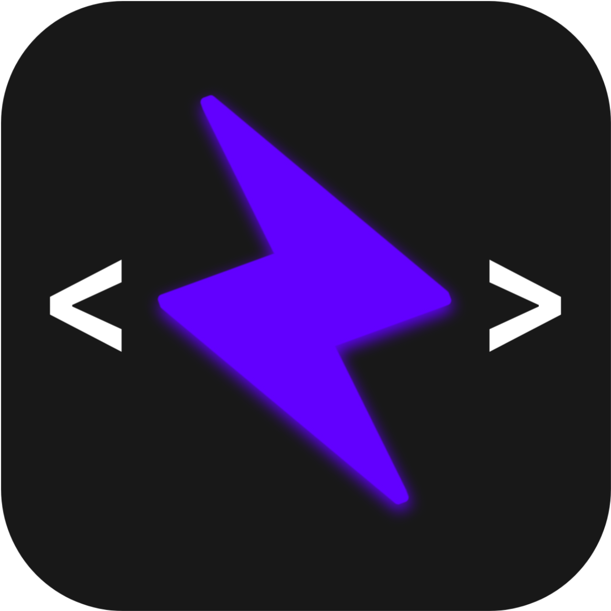

# About
ZEUS (Zephyrus UserScript) is a repository containing my collection of userscripts, primarily ones that I use myself. Most of them are vibecoded and tailored specifically for better reachability and usability on mobile devices, particularly in [Via Browser.](https://play.google.com/store/apps/details?id=mark.via.gp)

## <ins>Disclaimer</ins>
Some scripts in this repository are not my own work. Full credit goes to their respective authors and owners, with credits and original sources provided where applicable.

---

## Scripts (Click to Install)
##### [Civitai Top to Bottom](https://raw.githubusercontent.com/XYZephyrus/ZEUS/refs/heads/main/script-civitai-top-to-bottom.user.js)
A script to make navigating around [Civitai](https://civitai.red) easier on mobile devices

##### [Danbooru Top to Bottom](https://github.com/XYZephyrus/ZEUS/raw/refs/heads/main/script-danbooru-top-to-bottom.user.js)
A script to make navigating around [Danbooru](https://danbooru.donmai.us) easier on mobile devices

##### [DarkReader](https://github.com/XYZephyrus/ZEUS/raw/refs/heads/main/script-darkreader.user.js)
A customizable script to bring the famous [DarkReader](https://darkreader.org) browser extension to mobile through its API using userscript.

##### [Disable Google AMP](https://github.com/XYZephyrus/ZEUS/raw/refs/heads/main/script-disable-amp.user.js)
Disables Google AMP pages and redirects them to their original URLs.

##### [DuckDuckGo Header Lock](script-ddg-header-lock.user.js)
A simple script to make DuckDuckGo's header stays visible.

##### [DuoHacker](https://raw.githubusercontent.com/XYZephyrus/ZEUS/refs/heads/main/script-duolingo-duohacker.user.js) / [Original](https://greasyfork.org/en/scripts/561041-duolingo-duohacker) [Source](https://github.com/DuoHacker/DuoHacker)
A Duolingo cheat menu.

##### [EH Downloader](https://github.com/XYZephyrus/ZEUS/raw/refs/heads/main/script-ehentai%20downloader.user.js) / [Original](https://openuserjs.org/scripts/zsyjklive.cn/ComicLooms#operates) [Source](https://github.com/MapoMagpie/eh-view-enhance) 
Enables quick and convenient browsing of galleries or artists' homepage on a [certain site](https://e-hentai.org), with batch download support, focusing on browsing experience and low site load.

##### [Endless Google Result](https://github.com/XYZephyrus/ZEUS/raw/refs/heads/main/script-endless-google.user.js) / [Original](https://openuserjs.org/scripts/tumpio/Endless_Google) [Source](https://github.com/tumpio/gmscripts)
Disable pagination on Google search results.
 
##### [Fapello Fix](https://github.com/XYZephyrus/ZEUS/raw/refs/heads/main/script-fapello-header-fix.user.js) 
Fix the floating header in [that site](https://fapello.com) that usually happens when using an adblocker.

##### [Font Teller](https://github.com/XYZephyrus/ZEUS/raw/refs/heads/main/script-font-teller.user.js)
Displays a popup showing the font family currently used by the website.

##### [Force Open Link(s) in a New Tab](https://github.com/XYZephyrus/ZEUS/raw/refs/heads/main/script-force-open-links-in-new-tab.user.js)
Forces clicked links to open in a new tab instead of redirecting the current one.

##### [Force SF](https://github.com/XYZephyrus/ZEUS/raw/refs/heads/main/script-force-sf-pro-nuke-(via-github).user.js)
Injects SF to any sites. (Might break icons)

##### [Gelbooru to Danbooru Color Scheme](https://github.com/XYZephyrus/ZEUS/raw/refs/heads/main/script-gelbooru-to-danbooru-color.user.js)
Applies Danbooru's color scheme to Gelbooru for a more familiar appearance.

##### [GitHub Header Lock](https://github.com/XYZephyrus/ZEUS/raw/refs/heads/main/script-github-header-lock.user.js)
Locks the header of GitHub's mobile layout.

##### [GitHub Annoyance](https://github.com/XYZephyrus/ZEUS/raw/refs/heads/main/script-github-annoyance.user.js)
Removes the Sponsor button on all github repository pages that could exceeds the viewport in a certain mobile device/browser.

##### [Global Scrollbar Hide](https://github.com/XYZephyrus/ZEUS/raw/refs/heads/main/script-global-scrollbar-hide.user.js)
Removes WebView's ugly scrollbar.

##### [HC Top to Bottom](https://github.com/XYZephyrus/ZEUS/raw/refs/heads/main/script-hc-top-to-bottom.user.js) 
A script to make navigating around [HC](https://hentai-cosplay-xxx.com) easier on mobile devices.

##### [Image Downloader - Button](https://github.com/XYZephyrus/ZEUS/raw/refs/heads/main/script-image-downloader-button.user.js) / [Original Source](https://openuserjs.org/scripts/Jefreesujit/Image_Downloader)
A script to create a small download button near every images loaded in a page.

##### [Invert - Brute Force Dark Mode](https://github.com/XYZephyrus/ZEUS/raw/refs/heads/main/script-invert-brute-force-dark-mode.user.js)
Forcing dark mode on a site by inverting all the color's hues. Only use when DarkReader failed to work.

##### [Misskon Top to Bottom](https://github.com/XYZephyrus/ZEUS/raw/refs/heads/main/script-misskon-top-to-bottom.user.js) 
A script to make navigating around [this site](https://misskon.com) easier on mobile devices.

##### [Naruto WikiFandom Force Unfold](https://github.com/XYZephyrus/ZEUS/raw/refs/heads/main/script-naruto-fandom.user.js)
Forces all infoboxes in [that site](https://naruto.fandom.com/wiki/) to stay spread.

##### [NH Blackout](https://github.com/XYZephyrus/ZEUS/raw/refs/heads/main/script-nhentai-blackout.user.js) 
A script to turns [that site's](https://nhentai.net) appearance to AMOLED dark mode.

##### [NH Folding Tags](https://github.com/XYZephyrus/ZEUS/raw/refs/heads/main/script-nhentai-folding-tags.user.js) 
A script to put the tags on a gallery inside a folding container so that we don't have to scroll that much when viewing a gallery with dozen of tags.

##### [Pull to Refresh](https://github.com/XYZephyrus/ZEUS/raw/refs/heads/main/script-pull-to-refresh.user.js)
Gives ability to do a pull to refresh gesture in Via which doesn't support it natively.

##### [Reddit Header Lock](https://github.com/XYZephyrus/ZEUS/raw/refs/heads/main/script-reddit-header-lock.user.js)
Locks the header of Reddit's mobile layout.

##### [Reddit NSFW Unblur](https://github.com/XYZephyrus/ZEUS/raw/refs/heads/main/script-reddit-nsfw-unblur.user.js) / [Original](https://greasyfork.org/en/scripts/485608-reddit-nsfw-unblur) [Source](https://github.com/zenstorage/Reddit-NSFW-Unblur)
Removes the annoying pop-up when viewing NSFW post in the mobile web version of Reddit.

##### [Ultimate TensorArt Script](https://github.com/XYZephyrus/ZEUS/raw/refs/heads/main/script-tensorart-ultimate-script.user.js)
[TensorArt](https://tensor.art) UI overhaul for excellent mobile reachability + AMOLED dark mode.

##### [Via Image Downloader](https://github.com/XYZephyrus/ZEUS/raw/refs/heads/main/script-via-image-downloader.user.js)
Yet another script to download all loaded images on a page.

##### [YouTube Adbon]( https://github.com/XYZephyrus/ZEUS/raw/refs/heads/main/script-youtube-adbon.user.js) / [Original Source](https://greasyfork.org/en/scripts/523405-youtube-adbon/post-install)
YouTube ads begone.

_TBA_
